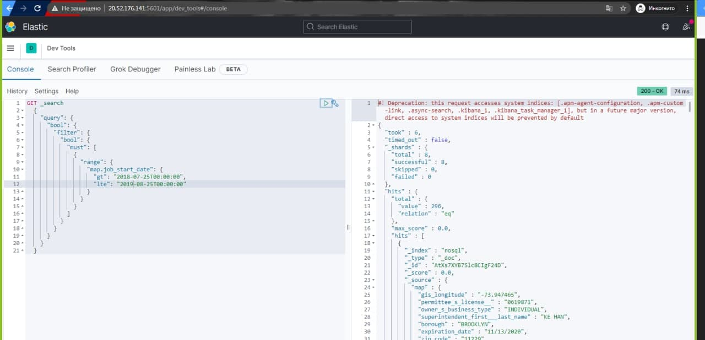

## software_doc_design_patterns

# Lab 5
1) you need to install nodejs https://nodejs.org/en/ and NPM(if needed)
2) clone my repo
3) change dir to cloned app
4) run npm install command
there is an endpoint (http://{yourhost}:8080/city_data/event-hub) for sending data to eventhub
5) create eventhub on Azure and define environment variable 'EVENT_HUBS_URL'
6) create a .env file in your project there you defile EVENT_HUBS_URL="your Connection string–primary key" and another variable PRINT_STRATEGY='EVENT_HUBS'
After this you should run npm run dev - it will run the app
Also you need to make request, you can use for it Postman

# Lab 6
- first step in to create a VM on Azure
- connect to VM using ssh
- for installing elasticsearch, kibana та logstach you should install https://logz.io/blog/install-elk-stack-azure/ . There are instructions for configuring.
- After the installation ELK stack trying to request vm-public-ip:9200 and vm-public-ip:5601 in our browser for checking if it works
- find Logic App > create Blank app > choose When event hub is listening > connect to our eventhub  
- next step is to choose an HTTP POST method. Sending data to eventhub and checking our triggers
    - Logic App 
        
    - Set up our eventHub
    
- <yourIP>:9200/nosql/_search?pretty=true here we have to see our data from eventHub
  - Data in ES
      
      
# Lab 7
- Open Kibana > Visualize > Pie 
          
- choose bucket > create new visualization Line with Bucket setting up for the x-axios and Split series
      
- quering using Dev Tools
      
```GET _search
{
  "query": {
    "bool": {
      "filter": {
        "bool": {
          "must": [
            {
              "range": {
                "map.job_start_date": {
                  "gt": "2018-07-25T00:00:00",
                  "lte": "2019-08-25T00:00:00"
                }
              }
            }
          ]
        }
      }
    }
  }
}

